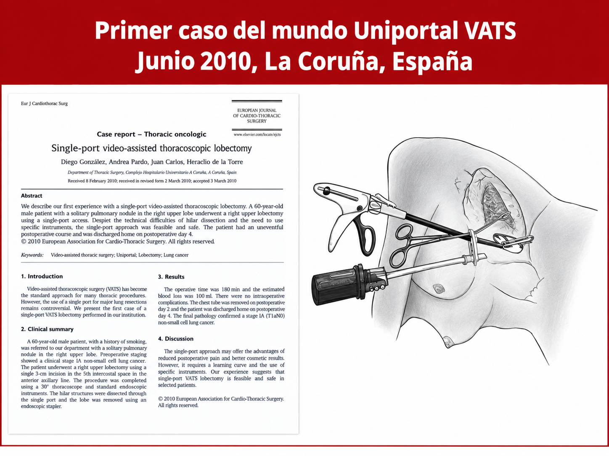
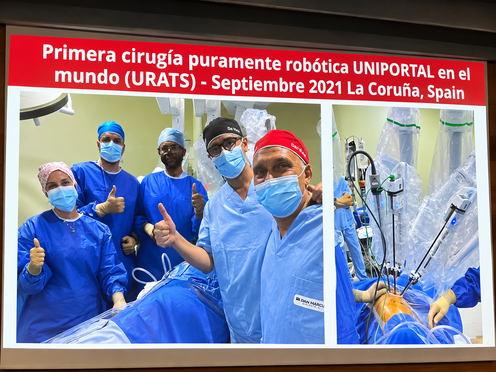
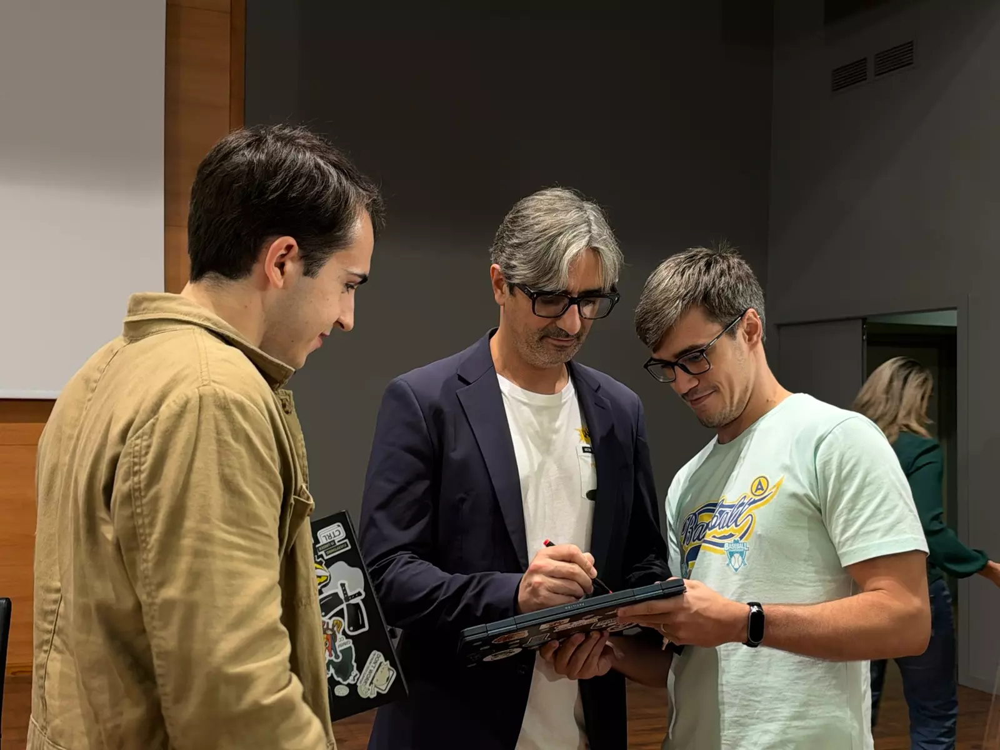
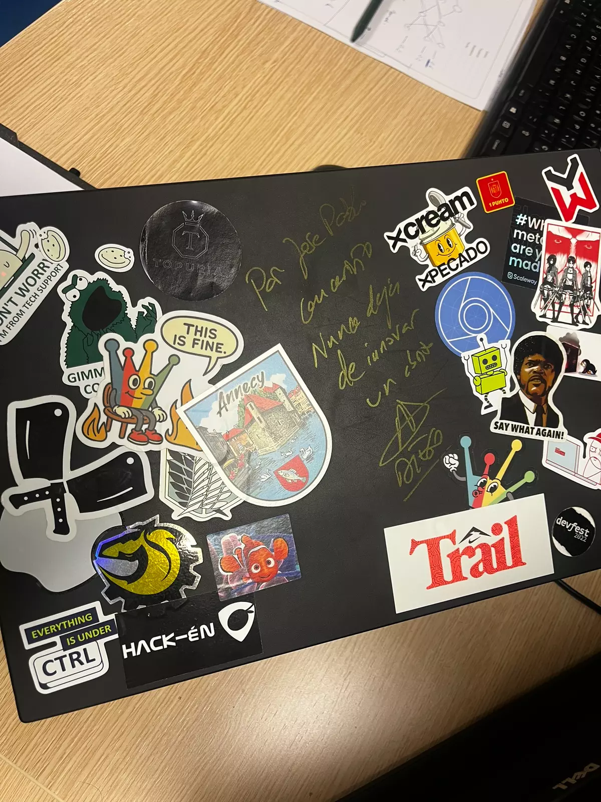

Diego González Rivas es un cirujano torácico de prestigio mundial, conocido por desarrollar una técnica mínimamente invasiva a través de una sola incisión.



Esta técnica permite operar al paciente realizando una única y milimétrica incisión, en lugar de abrirle las costillas con un separador costal, algo muchísimo más doloroso e invasivo.

A pesar de este gran avance, Diego decidió innovar aún más. Por ello, empresas de Silicon Valley contactaron con él.
Estas empresas le ofrecían patentes que permitieran operar al paciente usando dicha técnica pero de manera más robótica.

Así, con el paso del tiempo y con algún que otro incoveniente con dichas empresas, logró hacer la primera cirugía puramente robótica uniportal en el mundo (URATS).



También, un hito que me gustaría mostrar es que realizó la primera telecirugía torácida del mundo transcontinental (8000 km). 

Al finalizar la conferencia, tuve la oportunidad de preguntarle:

> **Yo:** ¿Qué limites observastéis relacionado con la conexión, puesto que un desfase de milisegundos podía provocar una situación indebida?
>
> **Diego:** Ninguna, la conexión basada en starlink funcionaba sin ningún tipo de problema, era super rápida. ¿El problema? Que este tipo de conexión es carísima y, por ejemplo, hospitales públicos no se lo pueden permitir.


Y después, le pedí una firma. ¿Dónde? En mi portatil. Diego se sorprendío, porque era la primera vez que firmaba uno (no sé cómo lo hace, pero siempre consigue ser el primero en conseguir algo :P). ¡Hasta se hizo un vídeo para subirlo a sus redes sociales!

::: {.galeria}
{.lightbox group="galeria" fig-alt="Diego González Rivas firmando mi portátil al terminar la charla"}

{.lightbox group="galeria" fig-alt="El portátil lleno de pegatinas con la dedicatoria y la firma de Diego"}

```{=html}
<video src="imgs/firma-portatil.mp4" controls playsinline preload="metadata"
       aria-label="Historia de Instagram de Diego: «Primera vez en mi vida que firmo un portátil»"></video>
```
:::


